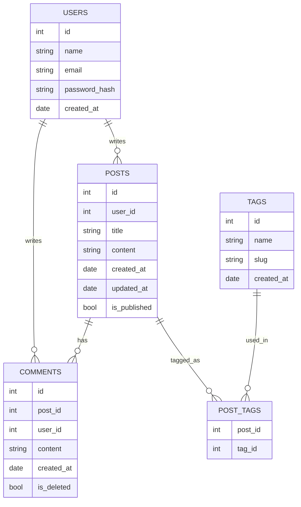

```mermaid
erDiagram
  USERS ||--o{ POSTS : writes
  USERS ||--o{ COMMENTS : writes
  POSTS ||--o{ COMMENTS : has
  POSTS ||--o{ POST_TAGS : tagged_as
  TAGS  ||--o{ POST_TAGS : used_in

  USERS {
    int id
    string name
    string email
    string password_hash
    date created_at
  }

  POSTS {
    int id
    int user_id
    string title
    string content
    date created_at
    date updated_at
    bool is_published
  }

  COMMENTS {
    int id
    int post_id
    int user_id
    string content
    date created_at
    bool is_deleted
  }

  TAGS {
    int id
    string name
    string slug
    date created_at
  }

  POST_TAGS {
    int post_id
    int tag_id
  }
```
