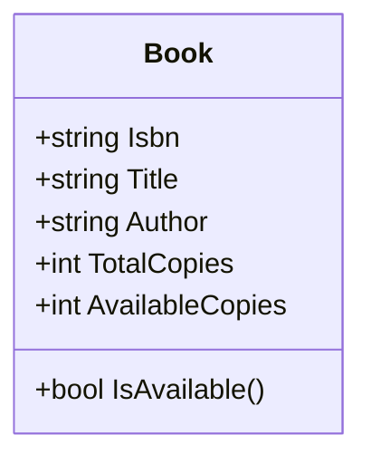

# Punto 3 — Sistema de Gestión de Biblioteca (C# / .NET 8)

Este proyecto implementa un sistema básico de gestión de bibliotecas en **C#** usando **.NET 8**.  
El sistema permite registrar **libros** y **miembros**, gestionar **préstamos** y **devoluciones**, además de listar y buscar libros.

---

## Especificaciones
- **Lenguaje:** C#  
- **Framework:** .NET 8  
- **Tipo de proyecto:** Consola  
- **Reglas de negocio:**  
  - Cada libro tiene un número total de copias y se controla la disponibilidad.  
  - Cada miembro puede tener un máximo de **3 préstamos** activos.  
  - Cada préstamo vence a los **14 días**.  

---

## Estructura del proyecto

```text
ConsoleApp-Clases/
├─ Book.cs          # Clase Book (modelo de libro)
├─ Member.cs        # Clase Member (modelo de miembro)
├─ Library.cs       # Clase Library (gestión de inventario y préstamos)
├─ Program.cs       # Programa principal (demo y pruebas)
├─ ConsoleAPP-Library.csproj
```

---

## Ejecución

1. Abre la carpeta ConsoleAPP- en una terminal.
2. Compila y ejecuta con:

```bash
dotnet run
```
3. Verás en la consola:
    - El inventario inicial de libros.
    - Préstamos y devoluciones simulados.
    - Resultados de búsquedas y préstamos activos.

---

## Diagrama de clases

